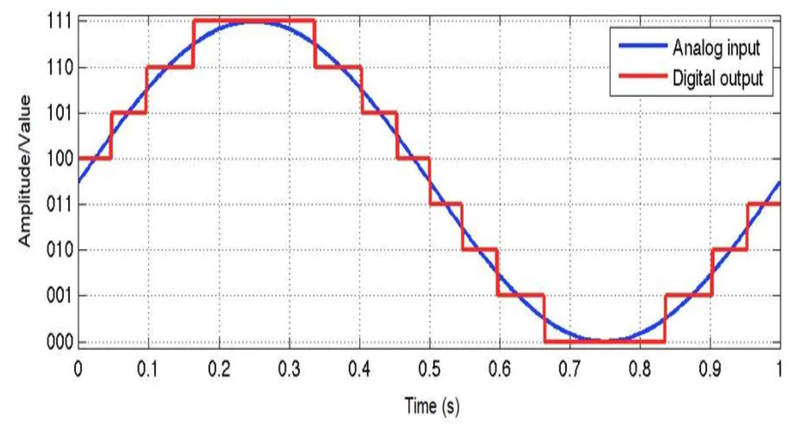
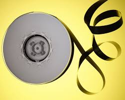

# Introduction to Audio Processing
**Prof. Dr. Rodrigo Schramm**        
**Prof. Dr. Marcelo Johann**        
**Prof. Dr. Marcelo Pimenta**        

> Intro video: https://youtu.be/5WVwjcJdiVY

In this module, we will learn how to manipulate the audio content in the digital domain. 
This module will be **hands-on**. A bit of theory will be introduced, but most of the theory presented here will be directly pointed to external videos/links. 
We will only work with offline processing. This means that we will not perform audio processing in real-time. Real-time audio processing will be addressed in the next module.

When we say *Audio Processing*, in fact, we are referring to digital signal processing. This means that we will compute the sequence of bytes in such a way that we can extract information from the sound/music, or we will transform some information into sound/music. 

## **Analog** versus **Digital**

### By the way, what is the difference between **analog** and **digital** audio? 

A very short explanation would be: **analog audio** is a **continuous signal**, while **digital audio** is a **discrete signal**.  Well, maybe this sentence doesn't help much. Please, have a look into the links available below. They are quite interesting and will help you to understand how a continuous signal can be transformed into a sequence (stream) of bytes that represents the audio content in the time domain. 

**Analog audio => Digital audio  (ADC)**

https://learn.sparkfun.com/tutorials/analog-vs-digital/all

https://www.youtube.com/watch?v=WxJKXGugfh8

https://www.liberaldictionary.com/a-d-c/

https://www.sharetechnote.com/html/Electronics_ADC.html


Of course, it is also possible to perform the inverse operation. 
 
**Digital audio => Analog audio   (DAC)**

https://www.youtube.com/watch?v=Y2OPnrgb0pY

So, from the digital audio, we can generate analog signals. Analog signals are usaly used to drive the loudspeakers which generate mechanic sound waves. These sound waves are the ones that reach our ears and then our brain interpret them as audio (sound). 
> Obs.: this is a very  short and simplistic explanation. Analog signals are used in many contexts (eg. Analog synthesizers, complex public address audio systems, sensors, etc). We will talk more about analog signals in other opportunities.  

The figure below illustrates the analog to digital conversion process for a single period of a sine wave. The number of sampling points per second in the horizontal axis gives the sample rate and the number of bits in the vertical axis gives the bit depth (or bit rate). 
> Question: What is the frequency of this sine wave? Answer: Since there is one period per second, its frequency (f = 1/T) is **1 Hz**. 


<!--
Format:  -->

<!--Format:  -->

##### Source: https://www.arrow.com/en/research-and-events/articles/engineering-resource-basics-of-analog-to-digital-converters


> Curiosity:  What is the used sample rate for ADC in the Compact Disc (CD) media? And in the DVD media? How about the bit depth in these medias?


*  **Question:** Can you link the sample rate choice used in the CD format with the Nyquist Theorem?

> Tip:  The sample rate must be twice the maximum frequency contained in the audio signal. This is will avoid aliasing.

> 
 
More information about Nyquist Theorem: 

> https://en.wikipedia.org/wiki/Nyquist_frequency

> https://en.wikipedia.org/wiki/Nyquist%E2%80%93Shannon_sampling_theorem


## Computing the sound

At the end of the ADC process, what we get is a sequence of values that represents the amplitude of the audio signal at each time step.  The figure below shows the first 10 samples of a sine wave (we are omitting the sample rate here) marked with red circles. Each of these marks corresponds, sequentially, to a  value of the data stream on the bottom of the figure.


<!--Format:  -->

This sequence of values is also known as PCM (Pulse Code Modulation). 
 > https://en.wikipedia.org/wiki/Pulse-code_modulation 

The Wave format file is a typical use of PCM to store a digital audio signal. 
> https://pt.wikipedia.org/wiki/WAV
> 
> http://soundfile.sapp.org/doc/WaveFormat/

A standard Wave file (.wav) has a header block to identify/describe the audio content. After the header, the digital audio content is placed in PCM format (byte stream).

> Obs.: Until here, we only addressed a single audio channel. In real audio applications, it is common to have many audio channels that must be organized in a logical way inside the data block of the wave file.  For example, if the audio file has two channels (left and right), then the wave file might interlayer the sequence of values:  numberL0 numberR0 numberL1 numberR1 numberL2 numberR2 ...
Where *number* might be a single byte (char), two bytes (integer), etc.


At this point, you can already write your own sound. Let's try this writing a simple code in C++. In order to help you to read/save your wave sound into a file, we will use the **libsndfile** library. 
> http://www.mega-nerd.com/libsndfile/

Please, have a look at the **/cpp/task01/** subdirectory. There you will find a makefile and a skeleton of our code for reading wav files.


# TASK 01: 
> video task01: https://youtu.be/7fwZgml7vcM


Compiling/building the task01.cpp code.

The header below will include the read/write wrappers to help us to manipulate wave files. It will just call the libsndfile to do the job. So, don't forget to install the libsndfile. It is included in this repository but you will need to install the correct version for your OS. See the http://www.mega-nerd.com/libsndfile/ website.

```cpp {.line-numbers}
#include "../read_write_wav.h"
```


After some declarations, you will find a block of code like this:

```cpp
 cout << "reading wav file..." << endl; 
 n_channels = read_wave_file(argv[1], audio_buffer, &buffer_len, &sample_rate); //[1]
 cout << "alloc memory for mono audio channels..." << endl;
 float* right = (float*) malloc(buffer_len/2*sizeof(float)); //[2]
 float* left = (float*) malloc(buffer_len/2*sizeof(float));  //[3]

```

It is not complicated: [1] reads the file.  WARNING: It will not deallocate the buffer automatically. :disappointed: Be careful.  [2] allocates a memory buffer for the left channel and [3] allocates a memory buffer for the right channel


```cpp
    cout << "copying stereo into two mono..." << endl;
    for (int i=0; i<buffer_len; i+=2)
    {
        // TODO
    }

```

The for-loop in the block above will be used to copy the input stream to the left and right buffers. Try to implement this as an exercise. Do not proceed to the next step of our module before doing this implementation.


========================

# TASK 02:
> video task02: https://youtu.be/_i1qWB6W7O8


# Writing a sound.

As you already have seen in the previous modules of this course, the audio can be generated through very complex shapes of sound waves. The beauty and richness of the sound and the music is in part in the way how these waves are combined. 

In the previous TASK, you learn how to load a wave file with a wave shape. We will return later to this technique. In fact, samplers are based on this kind of  resource. By now, we will learn how to generate a very simple and primitive waveform: the sine wave. 

Pure sine waves are special because they don't have any harmonics. You only hear the fundamental frequency. These kind of waves are very commonly used to build audio synthesizers, to control envelopes, etc.  


The audio stream can be interpreted as an audio tape. 


> Source: https://spectrum.ieee.org/computing/hardware/why-the-future-of-data-storage-is-still-magnetic-tape  

While in the audio tape  the recording head pointer advances in time by scrolling the tape, in the computational context the time is represented by an array index, and the tape is an audio buffer:

```cpp
for (int i=0; i<buffer_length; i++)
{
   // TODO:  write audio samples
   audio_buffer[i];
}
```

Thus, we can easily define a function for our sine wave: 

```cpp
audio_buffer[i] = A * sin(2 * M_PI * f *(i/Fs)); 
```
where A is the amplitude (you must keep its value between 0 and 1 to avoid clipping) and f is the frequency in Herts:
> https://en.wikipedia.org/wiki/Hertz 

 M_PI is &pi; = 3.1415, Fs is the sample rate and i/Fs is the time step. 

Once defined the sine wave function, we can write it in our audio buffer:

```cpp
for (int i=0; i<buffer_length; i++)
{
   audio_buffer[i] = A * sin(2 * M_PI * f *(i/Fs)); 
}
```

There is a sample in the **task02** directory.


Note that giving the sample rate **Fs**, we can easily define the sound duration by setting the *buffer_length* to be proportional to **Fs**. If *buffer_length* is equal to **Fs**, then the sound duration will be exactly 1 second. If you set  *buffer_length = 10xFs*, then your sound will last 10 seconds.  


You can also play with the frequency **f**. Try setting different values to it and then generate multiple wave audio files (or even changing the frequency along with the time).


# TASK 03
> video task03:  https://youtu.be/_lb1HF6djQE


## Creating melodies 
 
 
 There is a direct connection between the sound frequency and the pitch of the sound. One standard scale is the musical chromatic scale, where an octave is equally divided into 12 semitones (12 equal temperaments). 
 > https://en.wikipedia.org/wiki/Chromatic_scale#
 > https://en.wikipedia.org/wiki/12_equal_temperament

The music notes in this scale can be represented as integer values (one for each semitone). The MIDI protocol defines the integer 60 as the note C4. Thus, one octave below is C3 = 48 and one octave over is C5 = 72.  
> https://en.wikipedia.org/wiki/MIDI 
 
 A very easy way to map frequency in hertz to MIDI notes (integer values representing the chromatic scale) is using the following equations:


### From Hertz (freq) to MIDI:
```cpp 
float freq2midi(float freq)
{
    return 12*log2( freq/440) + 69;
}
```
 
### From MIDI to Hertz (freq):
```cpp 
float midi2freq(int m)
{
    return 440*pow(2,(m-69.0f)/12.0f);
}
```

There is an example that generates a table with frequencies and midi notes in the **task03** directory.


# TASK 04
> video task04: https://youtu.be/0u2s8jzgBsg 


You must create a melody using only a sine wave and 5 distinct semitones:
C D E F G. You can try any octave.

> Do you know the seven note names? 
> 
>  https://en.wikipedia.org/wiki/Solf%C3%A8ge


A direct map between the semitone index and the respective note name can be obtained by:

C  = 0, C# = 1, 
D  = 2,
D# = 3,
E  = 4,
F  = 5,
F# = 6,
G  = 7,
G# = 8,
A  = 9,
A# = 10,
B  = 11

Let's see one example:

If we choose octave 4, and the notes C D G.
Then we will need the MIDI numbers: 60 + 0, 60 + 2, 60 + 7.

If we choose two octaves below, we must subtract 2x12 = 24. In this case, the midi number would be: 36, 38, 43.

There is one code example in the **cpp/task04** directory.
This example introduces a common concept for audio processing. Usually, we design objects that perform some "processing" over a memory buffer. Typically, these objects are controlled and called in an audio thread.  We will not get in to this complexity in this module. However, the "philosophy" is very close with what in this demo code.

The example in task04 uses an abstract class called ``SoundProcessor`` :  

```cpp
  class SoundProcessor
  {
      public:
  
          virtual void process(float* audio_buffer, int buffer_length)
          {
          }
  };

```

You could extend this class and implement distinct type of sound processing methods. Also, the class could hold custom parameters, etc.

For example, you could write the ``SineWave : SoundProcessor`` class that will generate sine waves. 

```cpp
class SineOscillator : public SoundProcessor
  {
      public: 
  
          float freq; // frequency in Hz
          float amp; // audio amplitude (between 0.0 and 1.0)
          float Fs; // audio sample rate
  
          SineOscillator(int nota_midi, float _amp, float _Fs)
          {
              freq = midi2freq(nota_midi);
              amp = _amp;
              Fs = _Fs;
          }
  
          ~SineOscillator()
          {
          }   
  
          void process(float* audio_buffer, int buffer_len) 
          {
              for (int n=0; n<buffer_len; n++)
              {
                  audio_buffer[n] = amp * sin(2*M_PI*freq*(((float)n)/Fs)); 
              }
          }
  };
```


Or you could create the ``SquareWave : SoundProcessor`` class to generate square waves. You could also create a ``Reverb : SoundProcessor`` which will apply reverb to the sound buffer. 


# TASK 05
> video task05: https://youtu.be/Ts3PUNLHL2Q


Create your own music combining different notes built with sine waves and also copying parts from wave files. You must mix all in your audio buffer and then save into an output wave file. 

You must upload all tasks to the github repository. Please, add your c++ code files inside the the directory `` `cpp/students_upload/``
:
